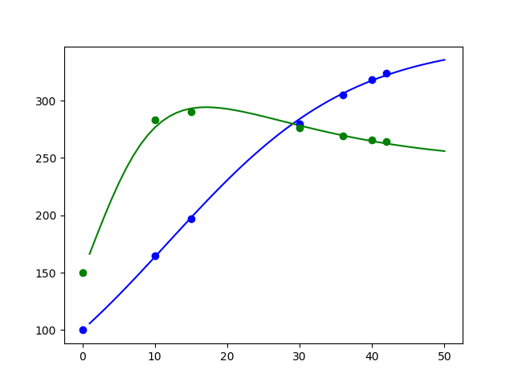
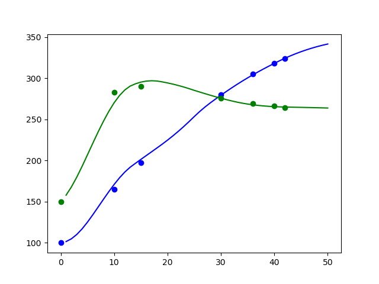
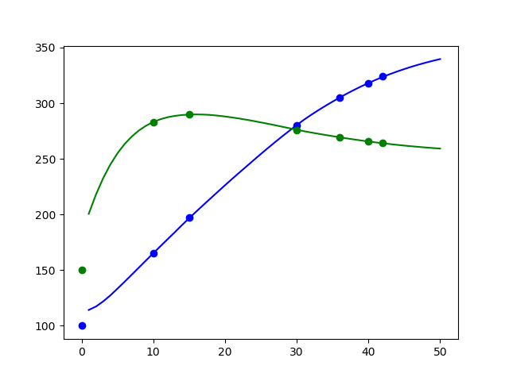

# 基于RNN的微分方程拟合

本项目是根据苏神的文章[貌离神合的RNN与ODE：花式RNN简介](https://spaces.ac.cn/archives/5643)，做一下发散思考。

同样以两生物种群竞争模型为例，解下面的微分方程：

$$ \begin{cases}
    \frac{d_{x_1}}{d_t} = r_1x_1(1-\frac{x_1}{N_1}) - a_1x_1x_2 \\

    \frac{d_{x_2}}{d_t} = r_2x_2(1 - \frac{x_2}{N_2}) - a_2x_1x_2
\end{cases}  $$

## 微分形式已知

需要说明的是，上述的微分方程形式已知，仅仅只是6个未知参数未知，那么可以直接结合欧拉解法和RNN进行求解，以下代码几乎照搬苏神，只不过用pytorch重新实现了一遍（`ode_rnn_a.py`）：

```py
class ODE_RNN(nn.Module):

    def __init__(self, steps, h):
        super().__init__()
        self.steps = steps
        self.h = h

        # 初始化6个参数
        self.weights = nn.Parameter(
            torch.tensor([0.1, 0.1, 0.001, 0.001, 0.001, 0.001], dtype=torch.float32)
            , requires_grad=True)

    def step_do(self, state):
        x = state
        r1, r2, a1, a2, iN1, iN2 = (self.weights[0], self.weights[1],
                                    self.weights[2], self.weights[3],
                                    self.weights[4], self.weights[5])
        _1 = r1 * x[:, 0] * (1 - iN1 * x[:, 0]) - a1 * x[:, 0] * x[:, 1]
        _2 = r2 * x[:, 1] * (1 - iN2 * x[:, 1]) - a2 * x[:, 0] * x[:, 1]

        _ = torch.stack((_1, _2), dim=-1)

        # 梯度截断，防止梯度爆炸
        step_out = x + self.h * torch.clamp(_, -1e5, 1e5)
        return step_out, step_out

    def forward(self, init):
        state = init
        outputs = []
        for step in range(self.steps):
            step_out, state = self.step_do(state)
            outputs.append(step_out)

        outputs = torch.stack(outputs, dim=1)

        return outputs
```

使用以下数据进行训练10000次：

$$
\begin{array}{c|ccccccc} 
\hline 
\text{时间} & 0 & 10 & 15 & 30 & 36 & 40 & 42\\ 
\hline 
x_1 & 100 & 165 & 197 & 280 & 305 & 318 & 324\\ 
\hline 
x_2 & 150 & 283 & 290 & 276 & 269 & 266 & 264\\ 
\hline 
\end{array}
$$

训练效果如下：



可以发现效果不错，但训练迭代次数很长。

## 微分方程形式未知

当然，对于实际情况，通常无法准确获知微分方程的具体形式，不过根据欧拉解法：

$$ x(t+h) = x(t) + hf(x(t), t)  $$

其中$f$可近似为$d_x$，即x的微分方程，虽然$f$未知，但是深度学习有个万能的近似定理，我们直接用一个多层全连接网络近似这个$f$。(`ode_rnn_b.py`)：

```py
class ODE_RNN(nn.Module):

    def __init__(self, steps, input_size, hidden_size):
        super().__init__()
        self.steps = steps

        # 多层全连接网络，用于拟合微分方程
        self.d_f = nn.Sequential(
            nn.Linear(input_size, hidden_size),
            nn.SELU(),
            nn.Linear(hidden_size, hidden_size),
            nn.SELU(),
            nn.Linear(hidden_size, input_size)
        )

    def step_do(self, state):
        x = state

        _ = self.d_f(x)

        # 进行梯度截断，防止梯度爆炸
        step_out = x + torch.clamp(_, -1e5, 1e5)
        return step_out, step_out

    def forward(self, init, steps=None):
        state = init
        outputs = []

        steps = self.steps if steps is None else steps

        for step in range(steps):
            step_out, state = self.step_do(state)
            outputs.append(step_out)

        outputs = torch.stack(outputs, dim=1)

        return outputs
```

ok，现在完全不知道这个微分方程的形式，训练10000次，效果如下：



基于以上的拟合结果可知，即使微分方程的形式未知，RNN网络同样能够找到一个足够近似$f$的函数。（代码中之所以使用SELU激活，主要是考虑到tanh的激活区间太窄，在数据数值很大，或没有做归一化操作时，tanh的梯度几乎为0，而RELU由于激活抑制，最终得到的曲线不是光滑曲线，使用SELU这类函数会有更好结果）。

## 更多

求解微分方程仅仅只是RNN中的一个特例，理论上更复杂的结构，如LSTM，会得到更好的结果，下面使用LSTM进行替换（`ode_rnn_c.py`）：

```py
class ODE_LSTM(nn.Module):

    def __init__(self, steps, input_size, hidden_size, num_layers):
        super().__init__()
        self.steps = steps

        self.en = nn.LSTM(input_size=input_size, hidden_size=hidden_size,
                          num_layers=num_layers, batch_first=True)
        self.de = nn.LSTM(input_size=input_size, hidden_size=hidden_size,
                          num_layers=num_layers, batch_first=True,)

        self.o_net = nn.Sequential(
            nn.Linear(hidden_size, hidden_size),
            nn.SELU(),
            nn.Linear(hidden_size, input_size)
        )

    def forward(self, init, steps=None):
        steps = self.steps if steps is None else steps

        # 实际上不需要进行输入，只是官方实现需要输入
        zeros = torch.zeros(init.shape[0],
                            steps,
                            init.shape[1],
                            dtype=init.dtype)

        # 获取初始值
        _, init_state = self.en(init.unsqueeze(1))

        outputs, _ = self.de(zeros, init_state)

        # steps
        outputs = self.o_net(outputs)

        return outputs
```

上面代码用一个LSTM获取第一步的初始值，然后另一个LSTM进行微分方程的拟合（虽然此时已经不能用单纯的微分拟合来解释网络的行为了），因此与其说用LSTM，不如说使用的seq2seq。由于LSTM的官方实现没有进行梯度截断，激活函数也是使用的tanh，因此在训练前对数据进行了归一化处理。以下是迭代1500次后的拟合结果：



从结果上看，seq2seq仅仅使用1500次迭代，就得到了超过前述方法的效果，证明seq2seq的结构优越性。

## 结论

通过上述分析结合苏神的文章，证明RNN具备相当强大的微分方程拟合能力的同时，还有下面结论：

1. 已知微分方程，RNN（仅本文中的特定RNN）的前向传播过程等效于积分
2. 已知一个函数上的多个点，它的微分方程未知，这时RNN（仅本文中的特定RNN）的反向传播等效于求解微分方程

## 应用

几乎可以应用在所有需要求解微分方程的问题中，并且RNN天然就是处理时序数据的工具。以气温预测为例，只要知道了气温变化的微分方程，就可以在一定程度上对气温进行预测。当然实际情况中，温度变化不止是一个点的变化，而是整个空间中的温度变化，可以结合重整化、粗粒化等技巧，实现真正的气象预测。

